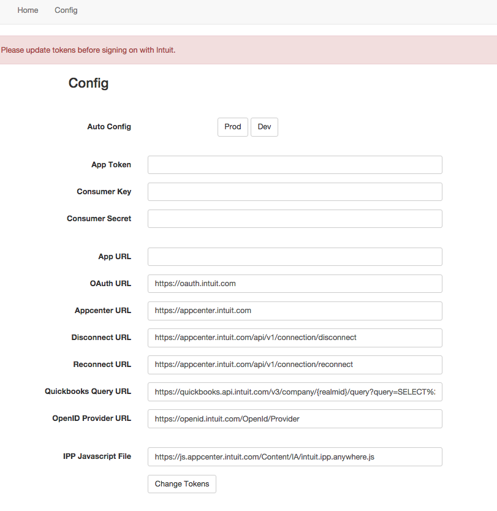
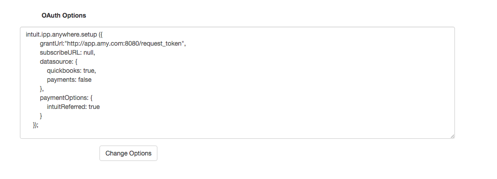
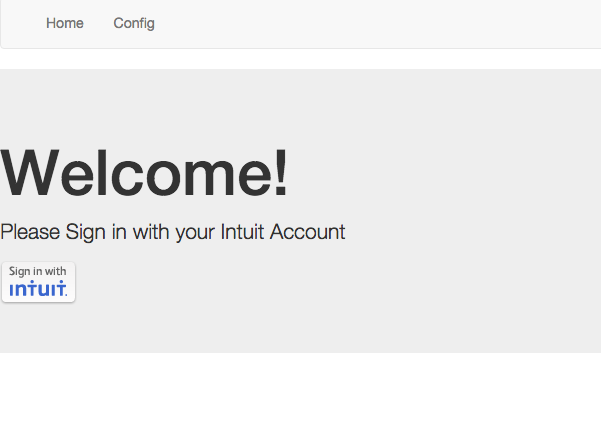
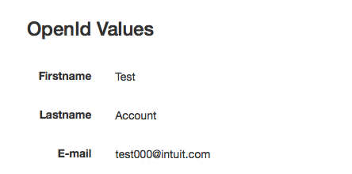
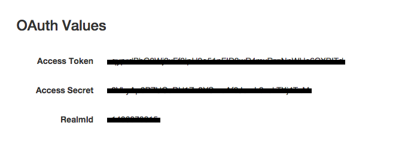
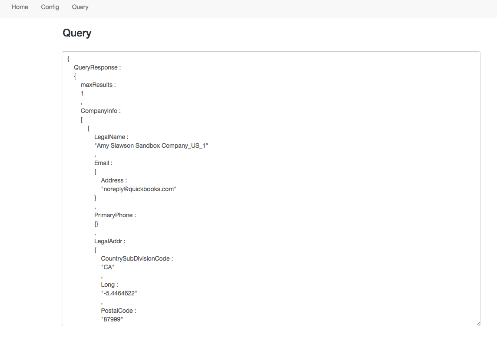
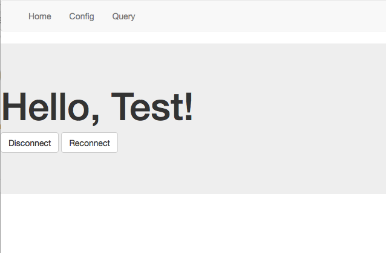
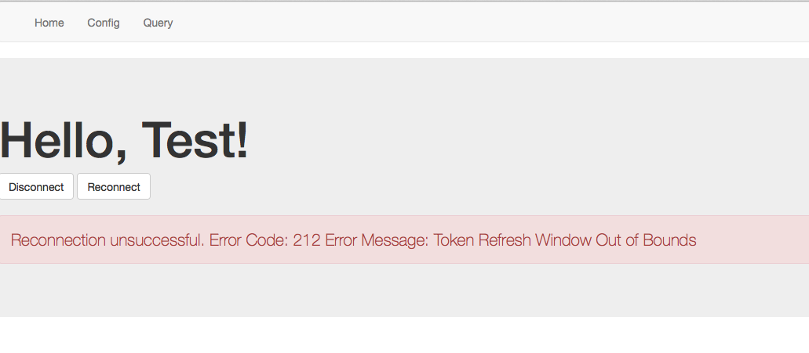

OAuth1/OpenID Java Sample App
--------------------

Welcome to the Intuit OAuth1/OpenID Java Sample App. 

This sample app is meant to provide working examples of how to integrate the OAuth and OpenID services without Intuit's SDK.  Specifically, this sample application demonstrates the following:

1. Implementing OpenID to allow customers to sign in with Intuit Account
2. Implementing OAuth to connect an application to a customer's QuickBooks Online company.
3. Implementing the Get App Now flow for customer's signing up on Apps.com

Please note that while these examples work, certain concerns are not addressed at all in our samples (e.g. security, privacy, scalability). In our sample apps, we strive to strike a balance between clarity, maintainability, and performance where we can. However, clarity is ultimately the most important quality in a sample app.

The app itself can be used to provide greater insight into the functionality of the various services and what inputs should be provided.  Note that consumer/access tokens and secrets are displayed on the app for demonstrative purposes and should be removed in production business applications.

In that light, we welcome any feedback that makes our samples apps easier to learn from.

## Table of Contents

* [Requirements](#requirements)
* [First Use Instructions](#first-use-instructions)
* [Running the code](#running-the-code)
* [High Level Workflow](#high-level-workflow)
* [How To Guides](#how-to-guides)

## Requirements

In order to successfully run this sample app you need a few things:

1. Java 1.8
2. Apache Maven 3.3.3 (if making changes to the code)
3. A developer.intuit.com account
4. An app on developer.intuit.com and the associated app token, consumer key, and consumer secret

## First Use Instructions

1. Clone the GitHub repo to your computer

## Running the code

Once the sample app code is on your computer, you can do the following steps to run the app:

 1. cd to the project directory
 2. Run the command `mvn package`
 3. Run the command: `./appStart.sh`
 4. Wait until the terminal output displays `FrameworkServlet 'dispatcherServlet': initialization completed in <xx> ms`
 5. Open your browser and go to `http://localhost:8080`
 6. To deploy app on a different port, from the root directory copy/paste the following command line and replace `<port_number>` with desired port: `java -jar target/Sample-App-1-1.0-SNAPSHOT.jar --server.port=<port_number>`

## High Level Workflow

###Configurations
* When app is started, it will redirect to the Config tab.
* Update App Token, Consumer Key, Consumer Secret to match app from developers portal.
* Update URLs to the corresponding environment.  
* Click "Change Token".
	* This will start an HTTP session to store session data.

* The Auto Config buttons may be used to update URL's specific to Production and Development environments.
    * If AppURL is not assigned, it will automatically populate with the host URL.

* Update OAuth Options.
	* The host URL with "/request_token" appended will appear in the grantURL.

###OpenID Execution

* Under the Home tab, click "Sign in with Intuit," and sign into Intuit account.

* The user information returned with OpenID is stored in the HTTP session, and can be found under the Config Tab.

* After updating the OAuth Options, click "Connect to Quickbooks" under the Home tab.

* The OAuth flow will begin by requesting and receiving Request Token and Request Secret. 
* Select desired Quickbooks Company to continue and click "Authorize"
OAuth will return Access Token and Access Secret which will be stored in the HTTP session and can be found under the Config Tab.

* Once connected to a Quickbooks Company, the Query tab will appear. This will perform queries and return data from the company.

* Queries can be customized by updating the "Quickbooks Query URL" under the Config tab.

###Reconnecting and Disconnecting

* Access Token and Access Token Secret can be renewed if in the appropriate time window.
* Reconnect or disconnect from the Home tab.

* If an error occurs during disconnect or reconnect, the error code and message will be displayed.

* After disconnect, the Home tab should again display the Connect to Quickbooks button.

###Ending Session

* To end the current session, click the log out tab in the upper right. This will return you to the beginning of the process at the Config tab.

###Get App Now (Try Buy) Flow

* To perform the Try Buy flow, input all necessary config parameters and start the session (clicking either the "Prod", "Dev", or "Change Tokens" buttons on the Config tab)
* Paste `https://appcenter.intuit.com/TryBuy/IA/<yourAppID>` into your browser
* This should call the OpenID and OAuth services and redirect to the app's home page with a connected Quickbooks Account

### How To Guides

The following How-To guides related to implementation tasks necessary to produce a production-ready Intuit Partner Platform app (e.g. OAuth, OpenId, etc) are available:

* <a href="https://github.com/IntuitDeveloper/SampleApp-TimeTracking_Invoicing-Java/wiki/OAuth-How-To-Guide-(Java)" target="_blank">OAuth How To Guide (Java)
* <a href="https://developer.intuit.com/docs/0050_quickbooks_api/0020_authentication_and_authorization/0011_from_the_intuit_app_center" target="_blank">Implementing Single Sign-On
* <a href="https://developer.intuit.com/docs/0050_quickbooks_api/0020_authentication_and_authorization/connect_from_within_your_app" target="_blank">OAuth Work Flow for Connecting Within App